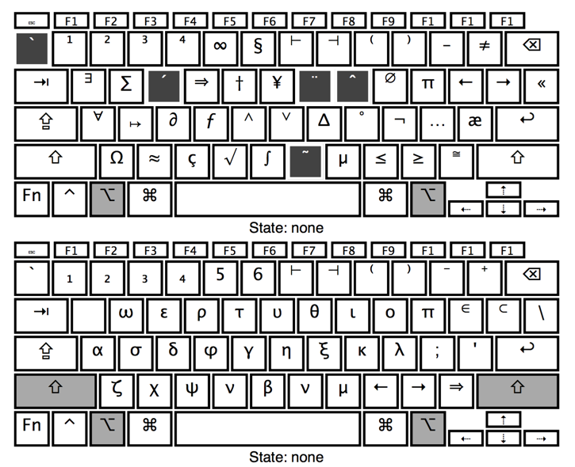

# MathKeyboardLayout

MathKeyboardLayout is a Mac keyboard layout that facilitates input of math symbols, for non-LaTeX environment.

It's currently under development. The current layout looks like the following

## Installation

Move `Customized.keylayout` to `/Library/Keyboard Layouts` 

    sudo cp Customized.keylayout /Library/Keyboard\ Layouts

Restart computer.

Add input method via `Preferences > Keyboard > Input Sources`. Currently this layout is called `U.S. Customized`.

## Usage

The top layout works when you press and hold the `option` key. The bottom layout works when you press and hold both the `option` key and `shift` (or just `option` when `caps lock` is on).

For example, to enter the string "∀ε, ∃δ" press `Option-A`, `Option-Shift-E`, `,`, `Space`, `Option-Q`, `Option-Shift-D` respectively.

